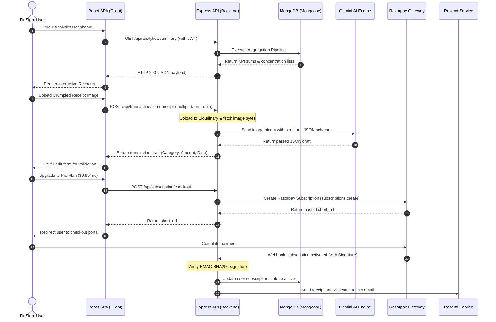

# <p align="center"> <span style="font-family: 'Outfit', sans-serif; font-weight: 600; font-size: 28px; vertical-align: middle;">FinSight</span></p>

<p align="center">
  <strong>Smart Financial Intelligence, Driven by AI.</strong>
</p>

<p align="center">
  <a href="https://github.com/mr-abdul-razzaq/FinSight">
  
  </a>
  <a href="https://www.typescriptlang.org/"></a>
  <a href="https://deepmind.google/technologies/gemini/"></a>
  <a href="https://razorpay.com/"></a>
  <a href="#"></a>
  <a href="#"></a>
</p>

---

## 1. Introduction

**FinSight** is a startup-grade, AI-powered personal finance management and analytics platform designed to convert dry financial records into actionable growth strategies. In today's economy, individuals and small business owners are inundated with manual bookkeeping, chaotic expense spreadsheets, and complex financial decisions. FinSight bridges the gap between passive ledger logging and active wealth orchestration.

### The Core Problem It Solves
- **Manual Data Entry Friction:** Bookkeeping fails when users have to manually type in every single cup of coffee, gas fill-up, or software subscription.
- **Data Without Insights:** Simply listing expenses does not help users build wealth. Standard dashboards display numbers but do not tell the *story* of where leaks occur and how to patch them.
- **Unmanaged Recurring Costs:** Subscriptions silently drain capital because they are not aggregated, projected, or verified dynamically.

### What Makes FinSight Unique
Unlike standard budgeting apps that act as glorified digital logbooks, FinSight combines the MERN stack with state-of-the-art **multimodal AI (Google Gemini)** to automate and elevate your financial life:
1. **Multimodal Receipt Parsing:** Drag-and-drop a crumpled, blurry physical receipt; our system instantly transcribes it into structured transaction data.
2. **Generative Narrative Reporting:** Receive a monthly human-like financial diagnosis outlining savings rates, patterns, and personalized investment suggestions.
3. **Automated Recurrence Engine:** An internal daily cron-job architecture that expands scheduled financial inflows and outflows with pinpoint accuracy.
4. **Subscription-Gated SaaS Topology:** Out-of-the-box support for regional markets using a secure **Razorpay** billing integration.

---

## 2. Key Highlights & Tags

- 🚀 **Full-Stack Monorepo:** Managed inside a clean React SPA frontend and a robust Express + Mongoose backend.
- ⚡ **Lightning Fast Tooling:** Frontend orchestrated with **Vite**, **TypeScript**, **Redux Toolkit**, and **Tailwind CSS**.
- 🧠 **AI Processing Pipeline:** Secure integration with **@google/genai** for document OCR and text synthesis.
- 💳 **Enterprise Subscription Gateway:** Native **Razorpay** SDK integration for billing, plan upgrades, and webhooks.
- 🔄 **Automatic Cache Management:** Frontend API layer using **RTK Query** with tag-based cache invalidation.
- 📅 **Automated Workloads:** Lightweight cron jobs via **node-cron** for recurring events and monthly AI reports.

---

## 3. Detailed Features List

FinSight is packed with enterprise-grade features designed to make financial analysis seamless:

*   **AI Receipt Scanning:** Upload images of receipts. FinSight uploads them to Cloudinary, extracts their binary payload, and sends them to Gemini AI to generate a precise, structured transaction draft (Merchant, Date, Category, Amount in cents) ready to edit and save.
*   **Smart Analytics Dashboard:** A unified workspace displaying real-time financial metrics, dynamic balance charts, and category concentration summaries.
*   **Expense & Income Tracking:** Fully interactive logs with instant filtering, full-text search, and multi-parameter category mapping.
*   **Recurring Transactions Engine:** Define custom intervals (Daily, Weekly, Monthly, Yearly). Our automated cron worker expands transactions at midnight UTC so your balance sheets are always up to date.
*   **Monthly AI-Generated Reports:** Every month, a scheduled background job aggregates your transactions and generates custom, highly localized financial guidance from Gemini.
*   **CSV Import/Export:** Import thousands of historical banking records instantly. Features full-browser CSV parsing via `react-papaparse` and Mongoose bulk-write optimization.
*   **Authentication & Authorization:** Secure JWT-based session persistence, bearer token headers, and automated token-expiry redirects on the client.
*   **Real-Time Analytics:** On-demand database aggregation pipelines that calculate period-over-period financial gains/losses in single roundtrips.
*   **Responsive UI:** A stunning, desktop-to-mobile layout built on headless Radix UI components and custom animations via Framer Motion.
*   **Vibrant Dark Mode:** Full system theme selection persistent across reloads via custom Tailwind variables.
*   **Razorpay Subscriptions:** Free, Pro, and Business tiers. Users can upgrade instantly inside a secured sandbox checkout environment.
*   **Billing Management Portal:** Directly view plan limits, usage tallies, next renewal dates, and cancel or switch subscriptions on the fly.
*   **Report Scheduling:** Fine-grained dashboard settings allowing users to customize how and when their automatic email reports are delivered.
*   **Interactive Financial Insights:** Rich analytical tip-cards highlighting budget overflows and cashflow improvements.
*   **Transaction Duplication:** Clone complicated recurring receipts or ledger items in one tap.
*   **Profile Picture Management:** Upload custom avatars instantly with secure, managed image hosting via Cloudinary.
*   **Secure API Layer:** Standardized JSON envelopes, async exception-catching wrappers, Zod validator middleware, and cryptographic webhook verification.

---

## 4. Screenshots & Previews

*Here is a preview of the high-fidelity user interface:*

<table>
  <tr>
    <td width="50%">
      <p align="center"><strong>1. Landing Page & SaaS Tiers</strong></p>
      <!-- Placeholder for future screenshot -->
      
    </td>
    <td width="50%">
      <p align="center"><strong>2. Executive Dashboard</strong></p>
      <!-- Placeholder for future screenshot -->
      
    </td>
  </tr>
  <tr>
    <td width="50%">
      <p align="center"><strong>3. Advanced Charts & Analytics</strong></p>
      <!-- Placeholder for future screenshot -->
      
    </td>
    <td width="50%">
      <p align="center"><strong>4. Interactive Transactions Table</strong></p>
      <!-- Placeholder for future screenshot -->
      
    </td>
  </tr>
  <tr>
    <td width="50%">
      <p align="center"><strong>5. Billing & Subscription Management</strong></p>
      <!-- Placeholder for future screenshot -->
      
    </td>
    <td width="50%">
      <p align="center"><strong>6. Mobile Interface</strong></p>
      <!-- Placeholder for future screenshot -->
      
    </td>
  </tr>
  <tr>
    <td colspan="2">
      <p align="center"><strong>7. Multimodal AI Receipt Scanning</strong></p>
      <!-- Placeholder for future screenshot -->
      <p align="center">
        
      </p>
    </td>
  </tr>
</table>

---

## 5. Tech Stack Section

FinSight is built with modern, production-grade libraries, frameworks, and developer tools:

### Technology Mapping

| Layer | Technologies Used | Purpose & Choice Rationale |
| :--- | :--- | :--- |
| **Frontend** | React, TypeScript, Vite, Tailwind CSS, Radix UI, Framer Motion | **React + Vite** provides instant developer feedback and rapid rendering. **TypeScript** ensures design system and API contracts remain strictly typed. **Tailwind** is used for responsive layout configuration. |
| **Backend** | Node.js, Express, Passport JWT, Zod, Multer | **Express** provides a minimal, highly composable HTTP middleware chain. **Passport** handles robust bearer-token verification, and **Zod** secures API boundaries at runtime. |
| **Database** | MongoDB, Mongoose | **MongoDB** supports high-volume, JSON-native transaction records. **Mongoose** simplifies the orchestration of MongoDB aggregation pipelines. |
| **AI Services** | `@google/genai` (Gemini API) | Eliminates expensive, slow, custom OCR engines by employing Google Gemini's multimodal parsing for receipts and structured analysis. |
| **Payments** | Razorpay Node SDK | Handles complex billing lifecycles, recurring transactions, subscription state management, and localized customer invoices. |
| **Dev Tools** | TypeScript, ESLint, `ts-node-dev` | Enforces rigid code quality, type-aware linting, and automated local API reloading during development. |
| **Communications** | Resend API | Lightweight, modern transactional email delivery for scheduled monthly PDF reports. |
| **Asset Storage** | Cloudinary | Simplifies binary file hosting. Receipt images and user avatars are uploaded directly to the cloud, reducing local server overhead. |

---

## 6. System Architecture Overview

FinSight is built on a distributed, event-driven SaaS architecture designed for high availability and strict data separation:



### Core Data & Event Pipelines

1.  **State Management Flow:** All client UI components consume hooks generated by **RTK Query** (`transactionsAPI`, `analyticsAPI`, `subscriptionAPI`). Successful mutations (e.g., `createTransaction`) automatically invalidate cache tags (`transactions`, `analytics`), forcing background re-fetching so charts update instantly without requiring manual page reloads.
2.  **Multimodal AI receipt Pipeline:** A user drops an image. The backend streams the binary through Cloudinary to secure an HTTPS reference, reads the bytes into base64, and pushes it directly to Gemini. Gemini executes structural extraction against a strict Zod contract and responds with verified field blocks.
3.  **Razorpay Lifecycle Pipeline:** Subscription state changes are strictly authenticated. Webhooks dispatched from Razorpay's edge servers hit our server's raw route (`POST /api/webhook`), undergo SHA256 HMAC signature verification using a shared secret, and run database transitions atomically.
4.  **Cron Processing Engine:** The background system runs two processes inside `node-cron`:
    *   **Daily Transaction Expansion (00:05 UTC):** Uses cursor-based iterations to query all active subscriptions that are due, calling Mongoose's `bulkWrite` to insert derived child transactions.
    *   **Monthly Report Generator (1st of month at 02:30 UTC):** Pulls raw transactions, groups category tallies using Mongoose `$facet`, requests financial tips from Gemini, and issues beautiful HTML reports via Resend.

---

## 7. Directory Topology

```
FinSight/
├── backend/                  # TypeScript Node.js API Service
│   ├── src/
│   │   ├── @types/           # Custom Express & Passport types
│   │   ├── config/           # Database, Cloudinary, Env, Passport, Razorpay configs
│   │   ├── controllers/      # Route controllers (request parsing & validations)
│   │   ├── cron/             # Background automation engines (jobs & schedulers)
│   │   ├── enums/            # Shared error codes and model enums
│   │   ├── mailers/          # Resend integration templates
│   │   ├── middlewares/      # Express exception normalization & Auth guards
│   │   ├── models/           # Mongoose Schemas (User, Transaction, Subscription, Report)
│   │   ├── routes/           # REST API router endpoints
│   │   ├── services/         # Centralized Business Logic layer
│   │   ├── utils/            # Encrypted helpers, JWT creators, date calculators
│   │   └── validators/       # Zod schemas for sanitizing runtime inputs
│   │   └── index.ts          # Server entrypoint & Middleware bootstrapping
│   ├── tsconfig.json         # Backend type configuration
│   └── package.json          # Node scripts and dependencies
│
├── client/                   # Vite React + TypeScript Single Page App
│   ├── public/               # Static system assets (icons, images)
│   ├── src/
│   │   ├── @types/           # Global type configurations
│   │   ├── app/              # Redux RTK Store and Base API Client setup
│   │   ├── assets/           # Dynamic images & CSS variables
│   │   ├── components/       # Reusable components (UI, Data-Tables, Charts)
│   │   ├── constant/         # Front-facing plan models and links
│   │   ├── context/          # Theme context providers
│   │   ├── features/         # Redux state slices & RTK Query APIs (auth, subscription)
│   │   ├── hooks/            # Dynamic utilities (auth verification, responsive monitors)
│   │   ├── layouts/          # Dynamic structural shells (AppLayout, BaseLayout)
│   │   ├── lib/              # Composable utilities (Tailwind merges, cn helpers)
│   │   ├── pages/            # Core views (Dashboard, Settings, Transactions, Billing)
│   │   ├── routes/           # Protected routing and guards
│   │   └── main.tsx          # Application bootstrapper
│   ├── tailwind.config.js    # Styling architecture
│   ├── vite.config.ts        # Fast asset bundler configurations
│   └── package.json          # Frontend packages and script triggers
```

---

## 8. Installation Guide

Follow these steps to configure your local development environment:

### Prerequisites
- **Node.js** (v18.x or v20.x recommended)
- **MongoDB** (Local instance or MongoDB Atlas cluster connection string)
- **Git**

### Step 1: Clone the Repository
```bash
git clone <GitHub-Repository-Link>
cd <Project-Name>
```

### Step 2: Install Dependencies
Install dependencies for both the frontend client and the backend server:

```bash
# Install backend dependencies
cd backend
npm install

# Install client dependencies
cd ../client
npm install
```

### Step 3: Configure Environment Variables
You must set up environmental variables for both projects. See the [Environment Variables](#9-environment-variables) section below to create your `.env` files.

### Step 4: Run Development Servers
Start both backend and frontend development environments:

```bash
# Start backend server (listening on port 8000 by default)
cd backend
npm run dev

# Start frontend application (usually listening on port 5173)
cd ../client
npm run dev
```

### Step 5: Build Production Bundles
To prepare your application for deployment, build the production distributions:

```bash
# Build backend TypeScript to JS
cd backend
npm run build

# Build client React code to optimized static assets
cd ../client
npm run build
```

---

## 9. Environment Variables

Create the following files in their respective folders.

### Backend Configurations
Create `backend/.env` containing:

```env
# Runtime Environment (development | production)
NODE_ENV=development
PORT=8000
BASE_PATH=/api

# Database Connection URL
MONGO_URI=mongodb+srv://<username>:<password>@<cluster>.mongodb.net/<dbname>

# JWT Authentication Secrets
JWT_SECRET=your_ultra_secure_jwt_auth_secret_key
JWT_EXPIRES_IN=15m
JWT_REFRESH_SECRET=your_ultra_secure_jwt_refresh_secret_key
JWT_REFRESH_EXPIRES_IN=7d

# Google Gemini AI Key (multimodal receipt OCR & report generation)
GEMINI_API_KEY=AIzaSyYourGeminiApiKeyHere

# Cloudinary CDN Image Management (Avatar & Receipt hosting)
CLOUDINARY_CLOUD_NAME=your_cloudinary_cloud_name
CLOUDINARY_API_KEY=your_cloudinary_api_key
CLOUDINARY_API_SECRET=your_cloudinary_api_secret

# Resend Transactional Mail Service
RESEND_API_KEY=re_YourResendApiKeyHere
RESEND_MAILER_SENDER=no-reply@yourdomain.com

# Allowed CORS Origins (Frontend Address)
FRONTEND_ORIGIN=http://localhost:5173

# Razorpay Subscriptions (Indian Payment Operations)
RAZORPAY_KEY_ID=rzp_test_YourRazorpayKeyId
RAZORPAY_KEY_SECRET=your_razorpay_key_secret
RAZORPAY_WEBHOOK_SECRET=your_webhook_validation_secret_key
RAZORPAY_PRO_PLAN_ID=plan_ProPlanIdFromRazorpay
RAZORPAY_BUSINESS_PLAN_ID=plan_BusinessPlanIdFromRazorpay
```

### Client Configurations
Create `client/.env` containing:

```env
# Base API Connection Endpoint
VITE_API_URL=http://localhost:8000/api

# Encryption Key for Persisted Redux State in LocalStorage
VITE_REDUX_PERSIST_SECRET_KEY=redux-persist-security-token
```

---

## 10. Razorpay Integration Guide

FinSight migrated its subscriptions from Stripe to Razorpay to support local payments and recurring mandates seamlessly. Follow these steps to configure your payment sandbox:

1.  **Register a Developer Profile:** Sign up for an account at [Razorpay Dashboard](https://dashboard.razorpay.com).
2.  **Generate API Credentials:**
    *   Navigate to **Settings** -> **API Keys** -> **Generate Key**.
    *   Save your `Key ID` and `Key Secret` immediately.
3.  **Define Subscription Plans:**
    *   Under the **Subscriptions** menu, click **Plans** -> **Create Plan**.
    *   **Pro Plan:** Configure a monthly rate of ₹799 (or local equivalent). Set billing frequency to monthly. Save the plan ID (e.g., `plan_N3vAxyz...`).
    *   **Business Plan:** Configure a monthly rate of ₹2,499. Save the plan ID.
4.  **Register a Webhook Target:**
    *   Navigate to **Settings** -> **Webhooks** -> **Add New Webhook**.
    *   **Webhook URL:** Expose your local server using a tool like `ngrok` (e.g., `https://xxxx.ngrok-free.app/api/webhook`).
    *   **Secret:** Create a random token and insert it into `RAZORPAY_WEBHOOK_SECRET` in `backend/.env`.
    *   **Active Events:** Choose `subscription.activated`, `subscription.charged`, `subscription.updated`, `subscription.cancelled`, and `subscription.completed`.
5.  **Run Sandbox Tests:** Complete a mock transaction using Razorpay's test cards to verify that subscriptions update to `active` in your database.

---

## 11. API Specifications

All request and response objects use standardized JSON envelopes. Protected endpoints require the `Authorization: Bearer <JWT_TOKEN>` header.

### 1. Authentication Modules (`/api/auth`)

| Endpoint | Verb | Description | Request Body | Success Response (200/201) |
| :--- | :--- | :--- | :--- | :--- |
| `/register` | `POST` | Creates user profile and default report configuration. | `{ "email": "[EMAIL_ADDRESS]", "password": "[PASSWORD]", "name": "User-Name" }` | `{ "message": "Registered successfully", "data": { "user": {...} } }` |
| `/login` | `POST` | Validates credentials and returns JWT session key. | `{ "email": "[EMAIL_ADDRESS]", "password": "[PASSWORD]" }` | `{ "message": "Logged in", "data": { "token": "...", "expiresAt": 1716... } }` |

### 2. Transaction Management (`/api/transaction`)

| Endpoint | Verb | Description | Request Body / Params | Success Response (200/201) |
| :--- | :--- | :--- | :--- | :--- |
| `/create` | `POST` | Logs a new transaction in cents. | `{ "title": "SaaS Subscription", "amount": 1999, "type": "expense", "category": "Tech" }` | `{ "message": "Transaction created", "data": {...} }` |
| `/scan-receipt` | `POST` | Extracts fields from receipt image via Gemini. | `multipart/form-data` (Key: `receipt`, File: Image) | `{ "message": "Parsed successfully", "data": { "amount": 4500, "category": "Food", ... } }` |
| `/update/:id` | `PUT` | Edits an existing transaction. | `{ "title": "Updated Title", "amount": 2500 }` | `{ "message": "Transaction updated", "data": {...} }` |
| `/all` | `GET` | Fetches transactions with pagination, regex filters, and date ranges. | Query: `?page=1&limit=10&search=gas&startDate=2026-05-01` | `{ "data": [...], "pagination": { "totalCount": 42, "totalPages": 5 } }` |
| `/bulk-delete` | `DELETE` | Deletes selected transactions. | `{ "ids": ["id1", "id2"] }` | `{ "message": "Transactions deleted" }` |

### 3. Analytics Aggregations (`/api/analytics`)

| Endpoint | Verb | Description | Request Parameters | Success Response (200) |
| :--- | :--- | :--- | :--- | :--- |
| `/summary` | `GET` | Computes period-over-period totals and balance deltas. | Query: `?startDate=2026-05-01&endDate=2026-05-31` | `{ "data": { "income": 450000, "expense": 120000, "netBalance": 330000 } }` |
| `/chart` | `GET` | Returns daily time-series coordinates for chart rendering. | Query: `?startDate=2026-05-01&endDate=2026-05-31` | `{ "data": [ { "date": "2026-05-01", "income": 5000, "expense": 200 } ] }` |
| `/expense-breakdown`| `GET` | Categorizes expenses and ranks top categories. | Query: `?startDate=2026-05-01&endDate=2026-05-31` | `{ "data": [ { "category": "Food", "value": 4500 } ] }` |

### 4. Scheduled Reporting (`/api/report`)

| Endpoint | Verb | Description | Request Parameters | Success Response (200) |
| :--- | :--- | :--- | :--- | :--- |
| `/all` | `GET` | Paginated archive of all generated reports. | Query: `?page=1&limit=10` | `{ "data": [...] }` |
| `/generate` | `GET` | Triggers immediate analytics aggregation and AI analysis. | None | `{ "message": "Report generated", "data": {...} }` |
| `/update-setting` | `PUT` | Configures automated report schedules. | `{ "frequency": "monthly", "enabled": true }` | `{ "message": "Settings updated", "data": {...} }` |

### 5. Billing Systems (`/api/subscription`)

| Endpoint | Verb | Description | Request Body | Success Response (200) |
| :--- | :--- | :--- | :--- | :--- |
| `/` | `GET` | Returns active plan details, limits, and usage counts. | None | `{ "data": { "plan": "PRO", "usageCount": { "receiptScans": 12 } } }` |
| `/checkout` | `POST` | Initiates Razorpay checkout flow. | `{ "plan": "PRO" }` | `{ "data": { "url": "https://rzp.io/i/sub_xyz" } }` |
| `/billing-portal` | `POST` | Generates a Razorpay Hosted short_url to manage plans. | None | `{ "data": { "url": "https://rzp.io/i/manage_abc" } }` |

---

## 12. Authentication Flow

FinSight's authentication workflow is secure and highly persistent:

```
[Client UI Form] 
       │  (Submit email/password)
       ▼
[POST /api/auth/login] ──► [Controller validations with Zod]
                                     │
                                     ▼
                      [User verification via Bcrypt]
                                     │
                                     ▼
                      [Sign JWT: Payload contains userId]
                                     │
                                     ▼
                      [Return token and expiresAt timestamp]
                                     │
       ┌─────────────────────────────┴─────────────────────────────┐
       ▼                                                           ▼
[Persisted in Redux-Persist]                              [Header Interceptor]
Stores token & profile in localStorage.                    Injects Authorization Bearer token into all requests.
```

### Core Security & Session Safeguards
- **Passport-JWT Authentication:** Protected backend routes use `passport.authenticate('jwt', { session: false })` to extract bearer tokens from the request headers and hydrate `req.user` securely.
- **Client-Side Auth Interceptor:** A dedicated hook (`use-auth-expiration.ts`) monitors token lifetimes. If the current time exceeds the `expiresAt` window, it immediately triggers the refresh flow or logs the user out to prevent unexpected API rejects.
- **Pre-Save Password Hashing:** User passwords undergo hashing using `bcrypt` (10 rounds) in a Mongoose pre-save hook, ensuring raw credentials are never stored in plain text.

---

## 13. Deep Dive: AI Features Pipeline

FinSight leverages advanced AI pipelines to extract receipts and generate custom monthly financial summaries.

### AI Receipt Scanning Pipeline
Our receipt processing pipeline provides fast and accurate data extraction:

```
[Physical Receipt Image]
          │
          ▼  (Multer catches file upload)
[Cloudinary CDN Cloud Storage] 
          │  (Returns managed HTTPS asset URL)
          ▼
[Express Server Controller] ──► [Download image bytes via Axios]
                                         │
                                         ▼
                               [Encode bytes to Base64]
                                         │
                                         ▼
                               [Google Gemini AI Engine]
                               Sent with a strict JSON format prompt.
                                         │
                                         ▼
                               [Strict JSON Response]
                               Parsed directly into transaction draft fields.
```

The Gemini API receives structured instructions that mandate a JSON-only response matching our transaction schema:
```json
{
  "title": "Merchant Name",
  "amount": 4500, // Normalized to cents
  "category": "Standard Financial Category",
  "date": "YYYY-MM-DD"
}
```

### Monthly AI Report Generation Pipeline
On the first day of every month, scheduled jobs aggregate transactions and prompt Gemini to generate personalized cashflow recommendations:

1.  **Mongoose Aggregation Step:**
    *   Calculates total income and total expenses.
    *   Aggregates category totals using `$facet`.
    *   Determines month-over-month differences in cashflow.
2.  **AI Prompts & Synthesis:**
    *   The structured metrics are passed to Gemini along with the user's current goals.
    *   Gemini processes the data and generates readable, human-like summaries outlining saving metrics, high-expenditure zones, and custom financial advice.
3.  **Delivery Step:**
    *   The generated summary is rendered into an HTML template and dispatched directly to the user's inbox using the Resend API.

---

## 14. Subscription & Plan Management

FinSight uses a tiered SaaS pricing model with feature gating managed in the database:

### Subscription Plans

| Capabilities & Limits | FREE Tier | PRO Tier | BUSINESS Tier |
| :--- | :--- | :--- | :--- |
| **Price** | ₹0 | ₹999 / month | ₹1,999 / month |
| **Receipt Scanning** | 5 scans / month | 50 scans / month | Unlimited |
| **AI Reports** | 1 report / month | 10 reports / month | Unlimited |
| **Dashboard Access** | Basic layout | Advanced layout | Custom analytics |
| **Support Channels** | Standard email | Priority queue | 24/7 Dedicated account manager |

### Feature Gating Architecture
All feature gates are evaluated dynamically at runtime. For example, before executing an AI receipt scan, our service layer checks the user's subscription limits:
```typescript
const subscription = await SubscriptionModel.findOne({ userId });
const currentLimit = PLAN_LIMITS[subscription.plan].receiptScans;

if (subscription.usageCount.receiptScans >= currentLimit) {
  throw new BadRequestException("Monthly receipt scanning limit reached. Please upgrade your plan.");
}
```

### Razorpay Webhook State Machine
Webhooks from Razorpay trigger the following state transitions:

```mermaid
stateDiagram-v2
    [*] --> FREE : User registers account (Default)
    
    FREE --> PRO : POST /checkout & Payment Completed
    note right of PRO : Event: subscription.activated
    
    PRO --> PRO : Event: subscription.charged (Updates period dates)
    
    PRO --> CANCELLED : Event: subscription.cancelled (Grace period ends)
    note right of CANCELLED : Plan downgraded to FREE
    
    PRO --> BUSINESS : Plan upgraded by user
    note left of BUSINESS : Event: subscription.updated
```

---

## 15. Security & Validation Controls

FinSight enforces strict security practices throughout its codebase:

*   **Database Isolation:** Database queries always include the `userId` fetched from verified JWT tokens, preventing unauthorized users from accessing or modifying other tenants' records.
*   **Cryptographic Webhook Verification:** The `/api/webhook` endpoint validates Razorpay headers by verifying that incoming HMAC-SHA256 signatures match your local webhook secret.
*   **Input Sanitization:** All public API endpoints pass parameters through Zod validation schemas, returning clean `400 Bad Request` messages instead of failing silently on malformed JSON payload injections.
*   **Zod Schema Type-Inference:** TypeScript interfaces are inferred directly from runtime validation contracts (`z.infer<typeof schema>`), keeping backend and frontend types synchronized.
*   **File Constraints:** Uploaded receipt files are constrained to a maximum of 5MB and validated to ensure only secure JPEG, PNG, and PDF extensions are parsed.
*   **Centralized Error Handling:** High-fidelity error handlers capture specific exceptions (e.g. `MulterError`, `ZodError`, `AppError`) and sanitize outgoing stack traces to prevent sensitive API leakage.

---

## 16. Performance & Scalability

FinSight is designed to handle high transaction volumes efficiently:

### Optimized Queries with Mongoose Aggregations
FinSight executes transactional analytics on-demand directly inside MongoDB using high-performance aggregation pipelines. This avoids fetching large datasets into the Node application layer:
*   **Period Delta Matching:** Uses `$match` to select transactions within specific date ranges.
*   **On-Demand Summaries:** Computes transaction totals using conditional summation (`$cond`) to evaluate incoming cashflow versus outgoing expenses.
*   **Time-Series Grouping:** Groups transactions using `$dateToString` to generate daily coordinates for Recharts without client-side parsing.
*   **Category concentration:** Uses `$facet` to group and aggregate top-spending categories in a single database roundtrip.

### Advanced Caching via RTK Query
To reduce database load, the React frontend leverages RTK Query's caching mechanics:
*   Cached analytical endpoints are reused across identical dashboard page transitions.
*   Mutations automatically trigger targeted cache invalidation tags, ensuring charts update instantly only when data actually changes.

### Scalable Background Jobs
Background tasks utilize cursor iterations (`cursor()`) to process large customer collections without overloading memory space. If a worker fails, Mongoose transactions isolate document commits to prevent database corruption.

### Future Scaling Options
*   **Database Indexing:** Add compound indexes on common access paths (e.g., `userId + createdAt`, `userId + type`).
*   **Queue-Backed Worker Threads:** Move heavy CPU operations (like PDF generating and email processing) out of the main thread and into a Redis-backed queue like BullMQ.
*   **Pre-computed Analytics:** Introduce daily aggregate collections to avoid running heavy on-demand aggregation queries for high-volume accounts.

---

## 17. Production Deployment Guide

Deploy your application using these cloud hosting setups:

### Frontend Client (Vercel)
1.  Sign in at [Vercel](https://vercel.com) and link your project repository.
2.  Select the `client/` folder as the root directory.
3.  Configure Build Settings:
    *   **Build Command:** `npm run build`
    *   **Output Directory:** `dist`
4.  Configure Environment Variables:
    *   Set `VITE_API_URL` to your production backend address (e.g., `https://api.yourdomain.com/api`).
    *   Set `VITE_REDUX_PERSIST_SECRET_KEY` to a random string.
5.  Click **Deploy**.

### Backend API Server (Render / Railway)
1.  Link your repository to your cloud provider.
2.  Set Root Directory to `backend/`.
3.  Configure Build Settings:
    *   **Build Command:** `npm run build`
    *   **Start Command:** `npm run start`
4.  Configure your environment variables inside the dashboard using the values in your local `.env`.
5.  **Expose Razorpay Webhook:** Ensure that your production backend URL (e.g. `https://api.yourdomain.com/api/webhook`) is correctly configured in your Razorpay Dashboard.

---

## 18. Future Roadmap

Future plans for FinSight include:

*   [ 1 ] **AI-Powered Budgeting Assistant:** Real-time conversational notifications that warn users when they are close to exceeding their category limits.
*   [ 2 ] **Investment & Net-Worth Tracker:** Live integrations with stock, crypto, and mutual fund APIs to track all your assets in one place.
*   [ 3 ] **Advanced OCR Engines:** Upgraded machine-learning pipelines for faster receipt processing and line-item invoice extractions.
*   [ 4 ] **Multi-user Workspace Collaboration:** Share transaction sheets and budgets with business partners, accountants, or family members.
*   [ 5 ] **Native iOS/Android Apps:** Launch hybrid mobile apps using React Native.
*   [ 6 ] **Predictive Cashflow Forecasting:** AI-driven predictions of your financial balance 30, 60, and 90 days out based on historic patterns.
*   [ 7 ] **Push Notifications:** Instant notifications for high-value transactions or unusual expense activity.
*   [ 8 ] **AI Financial Advisor Chat:** A personalized conversational interface to ask real-time questions about your spending habits and financial decisions.

---

## 19. Developer & Contributor

FinSight is independently developed and maintained by:

<table align="center">
  <tr>
    <td align="center">
      <a href="https://github.com/mr-abdul-razzaq">
        <sub><b>Mohammed Abdul Razzaq</b></sub>
      </a><br />
      💻 Full Stack Engineer
    </td>
  </tr>
</table>

### Contact & Portfolio Links
- **GitHub:** https://github.com/mr-abdul-razzaq


## 20. License

This repository is distributed under the terms of the MIT License.

```text
MIT License

Copyright (c) 2026 Mohammed Abdul Razzaq

Permission is hereby granted, free of charge, to any person obtaining a copy
of this software and associated documentation files (the "Software"), to deal
in the Software without restriction, including without limitation the rights
to use, copy, modify, merge, publish, distribute, sublicense, and/or sell
copies of the Software, and to permit persons to whom the Software is
furnished to do so, subject to the following conditions:

The above copyright notice and this permission notice shall be included in all
copies or substantial portions of the Software.

THE SOFTWARE IS PROVIDED "AS IS", WITHOUT WARRANTY OF ANY KIND, EXPRESS OR
IMPLIED, INCLUDING BUT NOT LIMITED TO THE WARRANTIES OF MERCHANTABILITY,
FITNESS FOR A PARTICULAR PURPOSE AND NONINFRINGEMENT. IN NO EVENT SHALL THE
AUTHORS OR COPYRIGHT HOLDERS BE LIABLE FOR ANY CLAIM, DAMAGES OR OTHER
LIABILITY, WHETHER IN AN ACTION OF CONTRACT, TORT OR OTHERWISE, ARISING FROM,
OUT OF OR IN CONNECTION WITH THE SOFTWARE OR THE USE OR OTHER DEALINGS IN THE
SOFTWARE.
```
